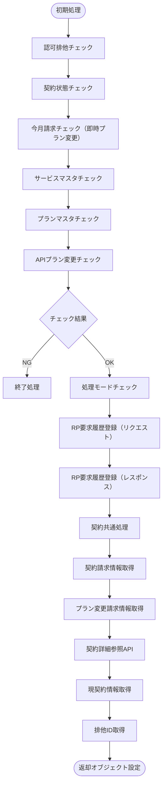

```mermaid
flowchart TD
    Start([初期処理])
    Start --> A[認可排他チェック]
    A --> B[契約状態チェック]
    B --> C[今月請求チェック（即時プラン変更）]
    C --> D[サービスマスタチェック]
    D --> E[プランマスタチェック]
    E --> F[APIプラン変更チェック]
    F --> G{チェック結果}
    G -- NG --> H[終了処理]
    G -- OK --> I[処理モードチェック]
    I --> J[RP要求履歴登録（リクエスト）]
    J --> K[RP要求履歴登録（レスポンス）]
    K --> L[契約共通処理]
    L --> M[契約請求情報取得]
    M --> N[プラン変更請求情報取得]
    N --> O[契約詳細参照API]
    O --> P[現契約情報取得]
    P --> Q[排他ID取得]
    Q --> End([返却オブジェクト設定])
```

