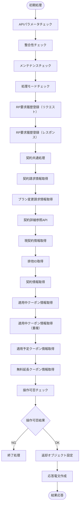

# プラン変更チェック 処理フロー（完全版）

以下はGitHub Flavored Markdown (GFM) によるMermaidフローチャートです。

```mermaid
flowchart TD
    Start([初期処理])
    Start --> A[APIパラメータチェック]
    A --> B[整合性チェック]
    B --> C[メンテナンスチェック]
    C --> D[処理モードチェック]
    D --> E[RP要求履歴登録（リクエスト）]
    E --> F[RP要求履歴登録（レスポンス）]
    F --> G[契約共通処理]
    G --> H[契約請求情報取得]
    H --> I[プラン変更請求情報取得]
    I --> J[契約詳細参照API]
    J --> K[現契約情報取得]
    K --> L[排他ID取得]
    L --> M[契約情報取得]
    M --> N[適用中クーポン情報取得]
    N --> O[適用中クーポン情報取得（重複）]
    O --> P[適用予定クーポン情報取得]
    P --> Q[無料延長クーポン情報取得]
    Q --> R[操作可否チェック]
    R --> S{操作可否結果}
    S -- NG --> T1[終了処理]
    S -- OK --> T2[返却オブジェクト設定]
    T2 --> U[応答電文作成]
    U --> End([結果応答])
```